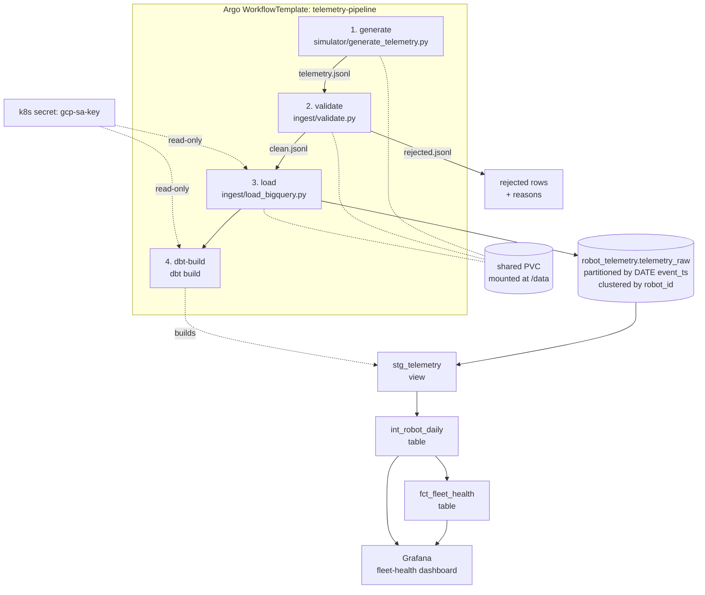

# robot-telemetry-pipeline

An end-to-end data pipeline for a fleet of commercial cooking robots: synthetic
telemetry is generated, validated against a contract, loaded into BigQuery,
modelled with dbt, orchestrated by Argo Workflows on Kubernetes, and read back
through a Grafana dashboard.

**This is a demonstration, not a production system, and the data is not real.**
There is no fleet of robots. `simulator/generate_telemetry.py` invents every
event, and it deliberately corrupts about 3% of them so the validation layer has
something to catch. The point of the repo is the *shape* of the thing — the
telemetry → warehouse → orchestration → dashboard pattern, wired end to end and
honest about its seams — not the numbers it produces. Nothing here has been
benchmarked, and nothing here has run at scale.

---

## Architecture



The four steps run as one linear DAG. Each step's output file is the next step's
input, passed on a per-run PersistentVolumeClaim mounted at `/data` in every pod
— there is no artifact repository to configure.

---

## Quickstart

Runs the pipeline by hand, without Kubernetes. Steps 1 and 2 need nothing but
Python; steps 3 and 4 need a GCP project and a service-account keyfile.

**Requirements:** Python 3.11 or newer.

### Install

```bash
git clone https://github.com/ajf42/robot-telemetry-pipeline.git
```

```bash
cd robot-telemetry-pipeline
```

```bash
python -m venv .venv
```

```bash
source .venv/bin/activate
```

On Windows, activate with `.venv\Scripts\activate` instead.

```bash
pip install -e ".[dbt]"
```

### 1. Generate telemetry — no cloud needed

```bash
python simulator/generate_telemetry.py --robots 15 --days 21 --seed 42
```

Writes `data/telemetry.jsonl`, plus a 200-line `data/sample_telemetry.jsonl`.
A given `--seed` and calendar date produce byte-identical output. On the run
used to write these docs it emitted 84,740 events across 15 robots, of which
2,542 carried an injected defect.

### 2. Validate — no cloud needed

```bash
python ingest/validate.py data/telemetry.jsonl --out data
```

Splits the feed into `data/clean.jsonl` and `data/rejected.jsonl`, printing a
breakdown by rejection reason. On the same run: 82,207 clean (97.01%), 2,533
rejected (2.99%), spread across all five injected defect types. Exits `1` if the
rejection rate exceeds `--max-reject-rate` (default `0.10`).

### 3. Load into BigQuery

Needs a service account with `roles/bigquery.dataEditor` and
`roles/bigquery.jobUser`.

```bash
export GOOGLE_APPLICATION_CREDENTIALS=/absolute/path/to/service-account.json
```

```bash
python ingest/load_bigquery.py --source data/clean.jsonl --replace
```

Creates the `robot_telemetry` dataset and the `telemetry_raw` table if they are
absent. `--replace` truncates and loads in one job, so re-running is safe.

### 4. Build the dbt models

```bash
mkdir -p ~/.dbt
```

```bash
cp dbt/profiles.yml.example ~/.dbt/profiles.yml
```

Edit that file and fill in the two placeholders: your GCP project id and the
absolute path to the same keyfile.

On Windows, `~/.dbt` resolves to `C:\Users\<you>\.dbt`, and PowerShell has no
`mkdir -p` — create the directory with this instead, then run the `cp` above as
written:

```powershell
New-Item -ItemType Directory -Force -Path ~/.dbt
```

```bash
cd dbt
```

```bash
dbt deps
```

```bash
dbt build
```

`dbt build` runs the three models in dependency order and every schema test in
the same pass, so a failing test stops the models downstream of it.

---

## The full run

The quickstart is the pipeline with the orchestration taken off. For the real
thing:

- **[orchestration/SETUP.md](orchestration/SETUP.md)** — create a k3d cluster,
  install Argo Workflows, build and import the image, create the credentials
  secret, submit the workflow, and watch it run. Includes a walkthrough of what
  each DAG step does and why.
- **[dashboards/provisioning.md](dashboards/provisioning.md)** — run Grafana in
  Docker, install the BigQuery datasource plugin, connect it, and import the
  dashboard.
- **[docs/architecture.md](docs/architecture.md)** — the contract schema, the
  dbt layer strategy, the DAG's retry and credential model, and what would have
  to change for this to be a production system.

---

## Repo layout

| Path | What it holds |
| --- | --- |
| `simulator/generate_telemetry.py` | Synthetic fleet telemetry as JSONL, with deliberate defects. |
| `ingest/schemas.py` | The contract as pydantic v2 models. Single source of truth. |
| `ingest/validate.py` | Splits raw JSONL into clean and rejected, gates on rejection rate. |
| `ingest/load_bigquery.py` | Loads clean rows into a partitioned, clustered table. |
| `dbt/models/` | `stg_telemetry` → `int_robot_daily` → `fct_fleet_health`, with tests. |
| `orchestration/` | Argo `WorkflowTemplate`, RBAC, container dbt profile, setup guide. |
| `dashboards/` | Grafana dashboard JSON and its provisioning guide. |
| `Dockerfile` | One image shared by all four pipeline stages. |

---

## Design decisions

**Defects are injected at generation, not bolted on later.** The simulator
corrupts roughly 3% of rows in place — duplicate `event_id`, null `robot_id`,
`temp_c` outside 15–260, `event_ts` in the future, an `event_type` of
`diagnostic_ping` that is not in the contract — and marks them in no way at all.
A validation layer tested against data labelled "this row is bad" proves
nothing; the defects have to be indistinguishable from real rows so the schema
has to actually catch them. It also means the rejection path is exercised on
every single run rather than only when something goes wrong, which is how you
find out that your error handling works.

**`telemetry_raw` is partitioned by `DATE(event_ts)` and clustered by
`robot_id`.** Those two columns are how every downstream query filters.
`int_robot_daily` groups by day, and the fleet-health view is per-robot, so
partitioning on date lets a rebuild read only the days it needs, and clustering
on `robot_id` co-locates one unit's rows within a partition. Both are set once
at table creation in `ingest/load_bigquery.py`. This is a structural choice
based on the query shapes, not a measured optimisation — the dataset here is far
too small for the difference to show up.

**Validation gates on the rejection *rate*, not on any single bad row.** A
telemetry feed always has some noise; a pipeline that halts on the first
malformed row is useless, and one that silently drops everything it dislikes is
worse. So `ingest/validate.py` keeps both sides — every rejected row is written
to `rejected.jsonl` alongside the reasons it failed — and exits non-zero only
when the share of rejects crosses `--max-reject-rate` (default 10%). A normal
run sits near 3% and passes. A feed that has genuinely degraded trips the gate
and stops before it reaches the warehouse. The threshold is the alarm; the
rejected file is the evidence.

**`fct_fleet_health` is a trailing 7-day rollup, and the window ends on the last
day in the data.** "Which robots are struggling" is a recent-behaviour question
— a fault from three weeks ago is history, not a work order — so the mart
answers it over one week rather than over all time. The window ends on
`max(activity_date)` from `int_robot_daily` rather than on `current_date`
because this is a demo running against a fixed historical load: anchoring to the
wall clock would leave the table correct but empty once the generated data aged
past a week, which looks identical to a broken pipeline.

---

## Known gaps

Deliberate omissions, listed so nobody goes looking for them: there is no
`CronWorkflow` or event trigger (the workflow is submitted by hand), no
alerting, no artifact repository, no Helm chart, no CI, and no automated tests
beyond dbt's schema tests. The workflow YAML and the Grafana dashboard have been
validated structurally but have not been run against a live cluster or a real
BigQuery project. See the production section of
[docs/architecture.md](docs/architecture.md) for what else is missing and why it
would matter.
